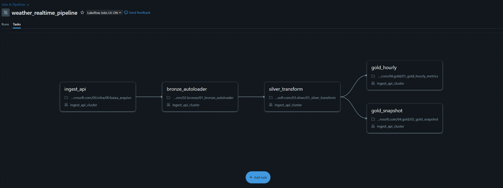
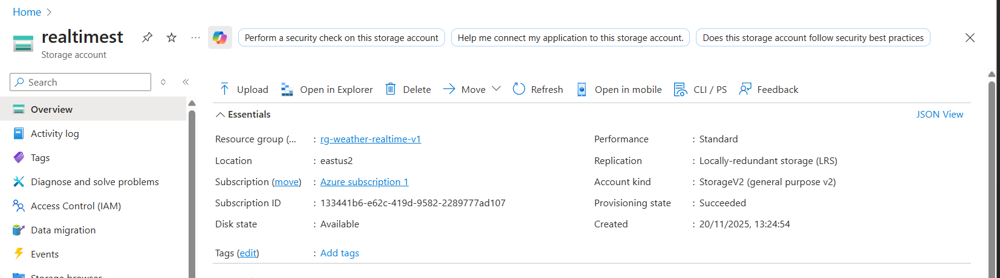
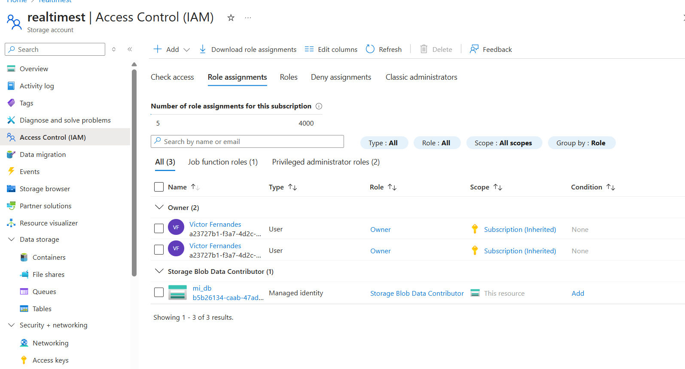
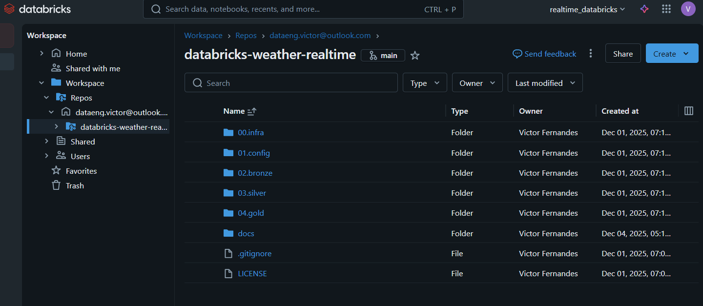
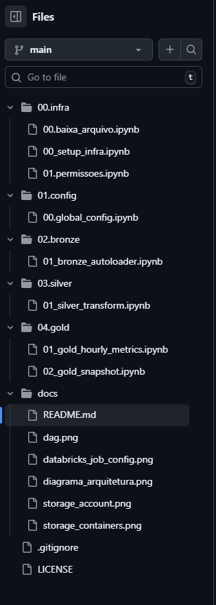

# Pipeline de Dados em Streaming com Azure + Databricks + Delta Lake

## 1. Visão Geral  
Este projeto implementa um pipeline de dados em **streaming** utilizando **Azure Databricks**, **Auto Loader** e **Delta Lake**, estruturado na arquitetura **Medalhão (Bronze → Silver → Gold)**.  

O objetivo é demonstrar um fluxo profissional e completo para ingestão, tratamento e disponibilização de dados, adequado para portfólio e alinhado às boas práticas oficiais de engenharia de dados.

---

## 2. Problema Resolvido  
APIs externas normalmente sofrem com:

- Falta de histórico persistente  
- Mudanças de schema  
- Dados duplicados ou incompletos  
- Fluxos manuais e frágeis  
- Ausência de governança e versionamento  

Este projeto resolve esses desafios ao fornecer:

- Ingestão contínua e incremental com **Auto Loader**  
- Controle ACID e Time Travel com **Delta Lake**  
- Transformações limpas e separadas por camadas  
- Orquestração confiável com **Databricks Jobs**  
- Governança via **Unity Catalog**  
- Versionamento profissional com **GitHub + Databricks Repos**

---

## 3. Arquitetura da Solução  

### 3.1 Diagrama de Arquitetura  
**INSERIR AQUI O DIAGRAMA COMPLETO DA ARQUITETURA**

Exemplo de elementos que devem aparecer no diagrama:
- API externa  
- Notebook de ingestão (streaming)  
- Auto Loader  
- ADLS containers (`raw`, `curated`)  
- Bronze → Silver → Gold (Delta Tables)  
- Unity Catalog  
- Databricks Jobs  
- GitHub  


---

### 3.2 Componentes Principais  

#### Azure
- Resource Group  
- Azure Databricks Workspace  
- Azure Data Lake Storage Gen2 (HNS ativado)  
- Containers: `raw` e `curated`  
- Access Connector for Databricks  
- RBAC para acesso ao ADLS  

#### Databricks
- Unity Catalog ativado  
- Schemas: Bronze, Silver, Gold  
- Notebooks versionados com Databricks Repos  
- Auto Loader para ingestão incremental  
- Tabelas Delta com otimização  
- Databricks Jobs para orquestração  

---

## 4. Fluxo (DAG) do Pipeline

```
API → Notebook de Ingestão (Streaming)
                ↓
           Bronze Layer
                ↓
           Silver Layer
                ↓
            Gold Layer
```



---

## 5. Detalhamento das Camadas  

### 5.1 Bronze — Ingestão  
Responsável por:

- Ler continuamente a API  
- Detectar novos arquivos automaticamente  
- Persistir dados brutos em **Delta Lake**  
- Utilizar **Auto Loader** para schema inference + evolution  
- Garantir idempotência via checkpoint  

### 5.2 Silver — Tratamento  
Responsável por:

- Limpar e padronizar o schema  
- Remover duplicidades  
- Tratar valores nulos  
- Normalizar tipos  
- Criar colunas derivadas  

### 5.3 Gold — Análises  
Responsável por:

- Agregações (ex.: hora, dia, tendência)  
- Criação de KPIs  
- Construção de tabelas otimizadas  
- Aplicação de **OPTIMIZE** e **ZORDER**  

---

## 6. Orquestração com Databricks Jobs  

As tarefas foram configuradas em um job com execução sequencial:

1. Bronze  
2. Silver  
3. Gold  

Agendamento recomendado: **a cada 5 minutos**


---

## 7. Infraestrutura no Azure  

### 7.1 Storage Account (ADLS)  
A organização do Data Lake segue a Arquitetura Medalhão, com **um único container** chamado `datalake`, contendo as pastas:

- `bronze` – ingestão bruta  
- `silver` – dados limpos e normalizados  
- `gold` – tabelas analíticas  
- `managed` – pastas de controle geradas automaticamente pelo Unity Catalog (quando aplicável)

**Overview do Storage Account:**  


**Estrutura do container `datalake`:**  


### 7.2 Access Connector + RBAC  
- Criado em Azure  
- Atribuição de roles no Storage Account  
- Permissões herdadas pelo Databricks  



---

## 8. GitHub + Databricks Repos (Versionamento)  

Este projeto utiliza **Databricks Repos** integrado ao **GitHub** através de um **Personal Access Token (PAT)**, permitindo versionamento completo, controle de branches, commits e sincronização automática entre o ambiente Databricks e o repositório remoto.

A estrutura real do repositório é organizada da seguinte forma:

```
├── 00.infra
│   ├── 00.baixa_arquivo.ipynb
│   ├── 00_setup_infra.ipynb
│   └── 01.permissoes.ipynb
│
├── 01.config
│   └── 00.global_config.ipynb
│
├── 02.bronze
│   └── 01_bronze_autoloader.ipynb
│
├── 03.silver
│   └── 01_silver_transform.ipynb
│
├── 04.gold
│   ├── 01_gold_hourly_metrics.ipynb
│   └── 02_gold_snapshot.ipynb
│
├── docs
│   ├── dag.png
│   ├── databricks_job_config.png
│   ├── diagrama_arquitetura.png
│   ├── storage_account.png
│   └── storage_containers.png
│
├── .gitignore
├── LICENSE
└── README.md
```

A imagem abaixo demonstra o repositório sincronizado corretamente dentro do **Databricks Repos**, exibindo a branch ativa (`main`) e as pastas versionadas:





---

## 9. Tecnologias Principais  

### Databricks  
- Apache Spark  
- Delta Lake  
- Auto Loader  
- Unity Catalog  
- Databricks Jobs  
- Databricks Repos  

### Azure  
- Azure Databricks  
- Azure Data Lake Storage Gen2  
- Access Connector  
- IAM/RBAC  

---

## 10. Justificativas Técnicas  

- **Auto Loader** reduz custo e elimina necessidade de Event Hub/Functions  
- **Delta Lake** garante transações ACID e histórico completo  
- **Arquitetura Medalhão** separa responsabilidades  
- **Unity Catalog** centraliza governança  
- **Jobs Databricks** simplificam orquestração  
- **GitHub** profissionaliza o fluxo de versionamento  

---

## 11. Como Executar o Projeto

1. Criar o **Azure Databricks Workspace** com Unity Catalog habilitado.  
2. Criar o **Azure Data Lake Storage Gen2 (ADLS)** com *Hierarchical Namespace (HNS)* ativado.  
3. Criar o container `datalake` contendo as pastas:
   - `bronze`
   - `silver`
   - `gold`
   - `managed`
4. Criar o **Access Connector for Azure Databricks**.
5. Atribuir a role **Storage Blob Data Contributor** ao Access Connector no Storage Account.
6. Conectar o repositório GitHub ao **Databricks Repos**.
7. Configurar os notebooks e executar o pipeline:
   - `02.bronze/01_bronze_autoloader.ipynb`
   - `03.silver/01_silver_transform.ipynb`
   - `04.gold/01_gold_hourly_metrics.ipynb`
   - `04.gold/02_gold_snapshot.ipynb`
8. Criar um **Databricks Job** e orquestrar a execução Bronze → Silver → Gold.
9. Definir um agendamento (recomendado: a cada 5 minutos).

---

## 12. Melhorias Futuras

- Migrar o pipeline para **Delta Live Tables**.  
- Adicionar monitoração de qualidade com **Expectations / Quality Gates**.  
- Implementar **CI/CD com GitHub Actions** para deploy automático das pipelines.  
- Criar dashboards ou APIs consumindo a camada **Gold**.  
- Adicionar testes automatizados para validação de schema e lógica de transformação.  


---


## 13. Autor  
Projeto desenvolvido para fins educacionais e portfólio de Engenharia de Dados, seguindo práticas baseadas em Databricks, Azure e Apache Spark.

